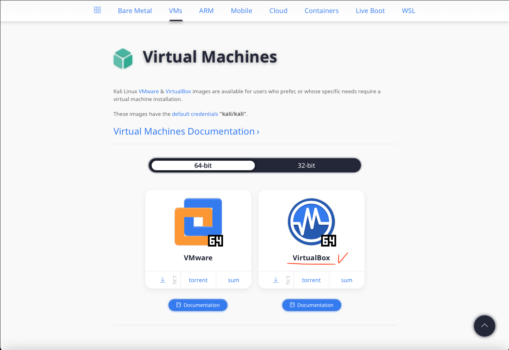
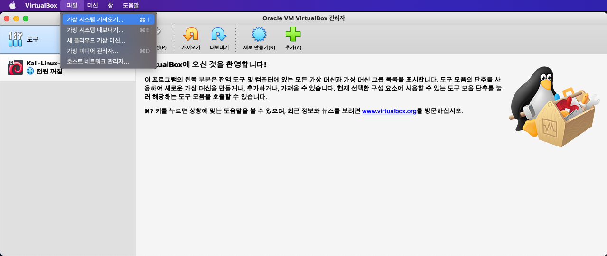
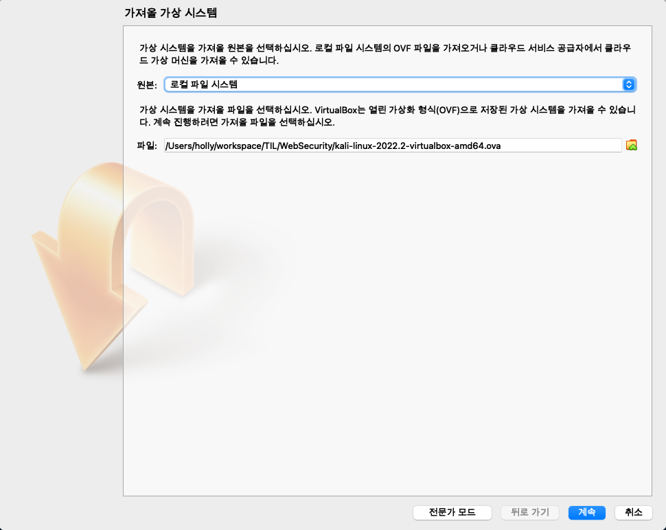
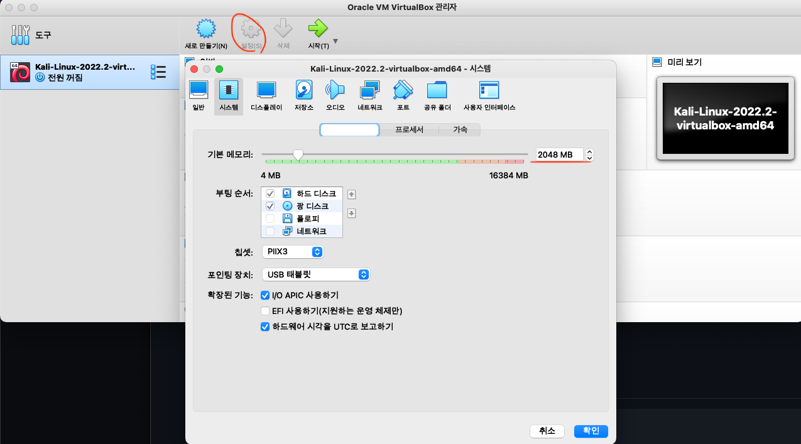
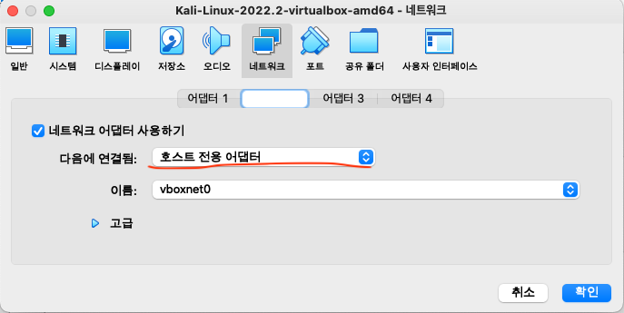
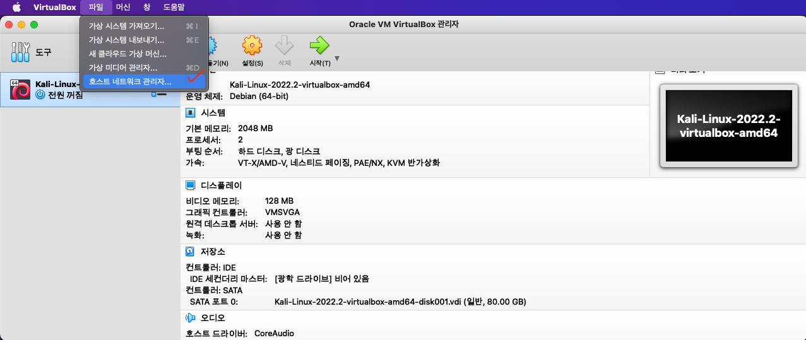
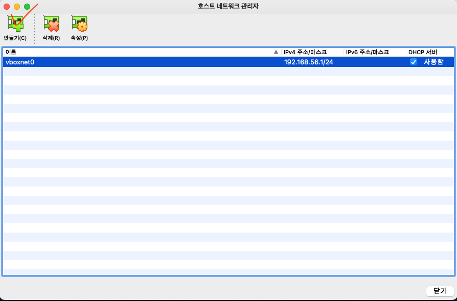
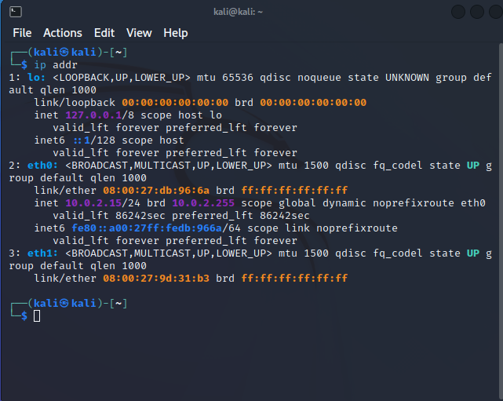
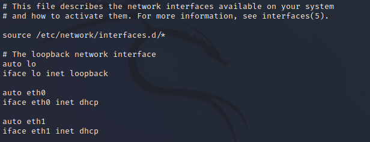
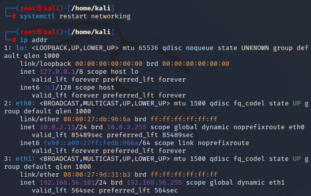

# 실습 환경 구성

## Virtual Box
가상화 프로그램을 통해 웹 모의해킹 실습<br>
설치 : [VirtualBox homepage](https://www.virtualbox.org)<br>

## KALI Linux
칼리 리눅스 가상 머신 이미지를 다운로드하여 설치한다.<br>
설치 : [KALI homepage](https://www.kali.org/get-kali/#kali-virtual-machines)<br>
<br>
설치한 가상환경과 PC환경의 비트 버전에 따라 선택해 다운로드<br><br>

## 가상 시스템 환경 설정
<br>
Virtualbox를 실행시킨 후 '가상 시스템 가져오기' 선택<br><br>
<br>
설치한 칼리 리눅스를 선택해서 불러오기<br><br>
<br>
칼리 리눅스 가상머신의 설정에 들어간다. 시스템 메모리는 2048로 설정하여 실습시 느려지는 현상을 방지한다.<br><br>
<br>
네트워크 어댑터를 NAT를 포함하여 하나 더 추가한다. 어댑터 2에서 호스트 전용 어댑터를 추가한다. 호스트 전용 어댑터를 사용하면, 가상 머신이 부팅된 후 사설 IP를 자동으로 할당받을 수 있고 이를 통해 통신할 수 있다.<br>
만약, 호스트 전용 어댑터를 사용할 수 없다면, 아래 사진과 같이 호스트 네트워크를 먼저 설정한다.
<br>
<br><br>

### 가상머신 내 네트워크 설정
어댑터 2개를 설정하면, 외부 인터넷과 사설 네트워크를 동시에 사용하지 못하는 현상이 발생한다.<br>

<br>
위 사진처럼 eth0와 달리 eth1은 ip 주소가 표시되지 않는다. 이를 해결하기 위해 ```/etc/netwoork/interfaces``` 파일을 수정한다.<br>
<br>
<br>
파일을 수정하고 네트워크를 다시 검색하면 위 사진과 같이 eth1도 ip가 할당되었음을 확인할 수 있다.<br><br>

## 실습용 가상 머신
웹 모의해킹 실습용 가상 머신이다. 비박스를 기반으로 하는 가상머신으로 실습한다.<br>
설치 : [실습용 가상 머신 설치 URL](https://github.com/bjpublic/whitehacker/)<br>
<br><br>

## 버프 스위트
### HTTP 프록시
사용자와 웹 서버 가운데에 위치하여, 서로 간의 HTTP 요청과 응답을 중간에서 전달<br>
전달 과정에서 메시지 조회/수정/삭제 가능